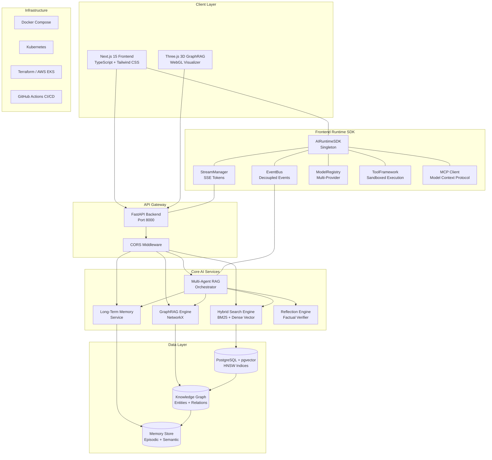
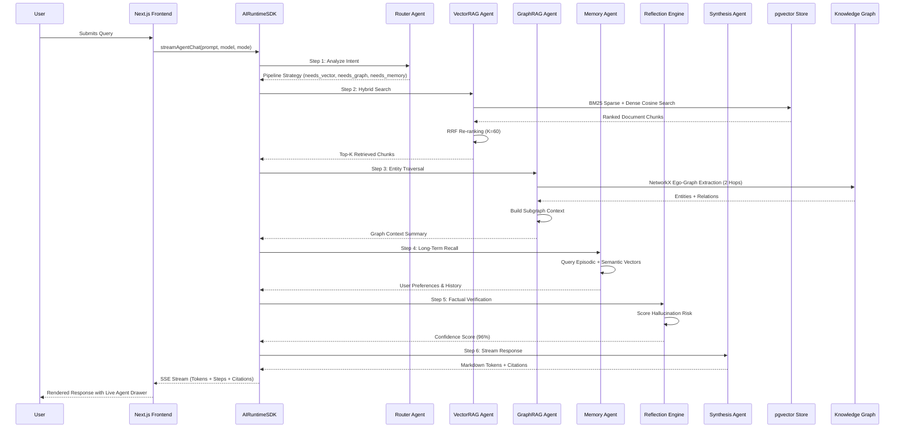
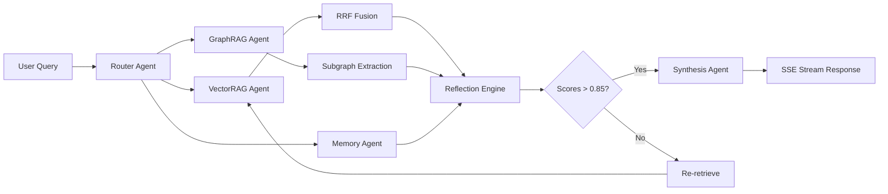
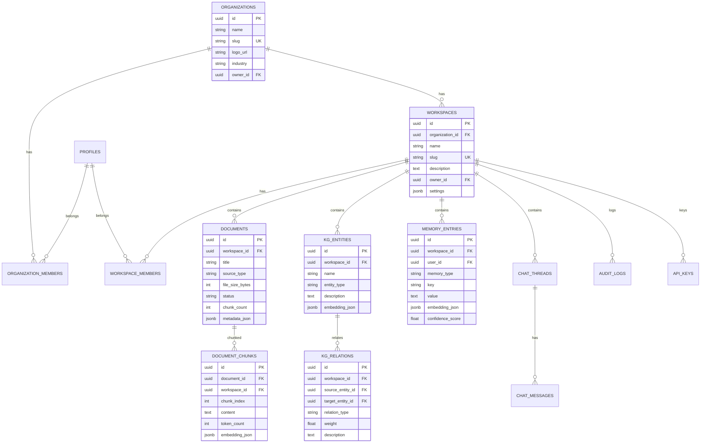

# NEXUS AI — Enterprise AI Knowledge Operating System


NEXUS AI is an **enterprise-grade AI Knowledge Operating System** engineered to rival top-tier platforms (ChatGPT Enterprise, Claude Projects, Perplexity AI, Cursor AI, and Notion AI). It unites **Multi-Agent RAG**, **GraphRAG entity traversal**, **pgvector hybrid search**, and **factual reflection loops** into a single unified platform with a fully-interactive 3D knowledge graph visualizer and low-code AI Studio.

---

## 📋 Table of Contents

- [System Architecture Overview](#system-architecture-overview)
- [Multi-Agent RAG Pipeline Flow](#multi-agent-rag-pipeline-flow)
- [Tech Stack](#tech-stack)
- [Project Structure](#project-structure)
- [Key Features & Enterprise Modules](#key-features--enterprise-modules)
- [Frontend Route Map](#frontend-route-map)
- [Database Schema](#database-schema)
- [Local Development Setup](#local-development-setup)
- [Deployment](#deployment)
- [API Reference](#api-reference)
- [License](#license)

---

## System Architecture Overview



---

## Multi-Agent RAG Pipeline Flow



---

## Tech Stack

### Backend
| Technology | Purpose |
|---|---|
| **Python 3.11.9** | Core runtime |
| **FastAPI 0.115** | Async REST API framework |
| **SQLAlchemy 2.0** | Async ORM with PostgreSQL |
| **NetworkX 3.4** | Knowledge graph traversal & analysis |
| **pgvector** | HNSW cosine vector search |
| **Pydantic v2** | Data validation & settings |
| **Uvicorn** | ASGI server |
| **python-jose** | JWT authentication |
| **passlib** | Password hashing (bcrypt) |

### Frontend
| Technology | Purpose |
|---|---|
| **Next.js 15** | React framework (App Router) |
| **TypeScript 5.7** | Strict type safety |
| **Tailwind CSS 3.4** | Utility-first styling |
| **Three.js / React Three Fiber** | 3D GraphRAG visualizer |
| **Framer Motion** | Animations & transitions |
| **Zustand** | Lightweight state management |
| **TanStack Query** | Server state & caching |
| **Lucide React** | Icon library |
| **react-markdown** | Markdown rendering |

### DevOps
| Technology | Purpose |
|---|---|
| **Docker / Docker Compose** | Containerization |
| **Kubernetes** | Production orchestration |
| **Terraform** | AWS EKS provisioning |
| **GitHub Actions** | CI/CD pipeline |

---

## Project Structure

```
NEXUS-AI/
├── backend/
│   ├── app/
│   │   ├── main.py                 # FastAPI entrypoint + lifespan
│   │   ├── core/
│   │   │   ├── config.py           # Settings (Pydantic)
│   │   │   ├── db.py               # Async SQLAlchemy engine
│   │   │   └── security.py         # JWT auth utilities
│   │   ├── models/
│   │   │   ├── domain.py           # SQLAlchemy ORM models
│   │   │   └── schemas.py          # Pydantic request/response schemas
│   │   ├── services/
│   │   │   ├── agentic_rag.py      # Multi-Agent Orchestrator (6 agents)
│   │   │   ├── graph_rag.py        # NetworkX GraphRAG engine
│   │   │   ├── hybrid_search.py    # BM25 + Dense RRF fusion
│   │   │   ├── memory_service.py   # Episodic & semantic memory
│   │   │   └── doc_processor.py    # Document chunking & ingestion
│   │   └── api/
│   │       └── v1/
│   │           ├── chat.py         # SSE streaming chat endpoint
│   │           ├── knowledge.py    # Document CRUD
│   │           ├── graph.py        # Knowledge graph endpoints
│   │           ├── workspace.py    # Workspace management
│   │           └── memory.py       # Memory CRUD
│   ├── requirements.txt
│   └── Dockerfile
│
├── frontend/
│   ├── src/
│   │   ├── app/
│   │   │   ├── layout.tsx          # Root layout
│   │   │   ├── page.tsx            # Landing page route
│   │   │   ├── (marketing)/        # Public marketing pages
│   │   │   ├── (auth)/             # Authentication pages
│   │   │   ├── (dashboard)/        # Authenticated dashboard pages
│   │   │   │   ├── chat/           # Multi-agent chat interface
│   │   │   │   ├── dashboard/      # Main enterprise dashboard
│   │   │   │   ├── knowledge/      # Knowledge base explorer
│   │   │   │   ├── graph/          # 3D GraphRAG visualizer
│   │   │   │   ├── agents/         # Multi-agent system viewer
│   │   │   │   ├── memory/         # Long-term memory platform
│   │   │   │   ├── embedding/      # Vector indexing dashboard
│   │   │   │   ├── retrieval/      # Hybrid search engine
│   │   │   │   ├── research/       # Deep research engine
│   │   │   │   ├── tools/          # Tool ecosystem & MCP
│   │   │   │   ├── observability/  # Quality & tracing dashboard
│   │   │   │   ├── governance/     # Admin center
│   │   │   │   ├── operations/     # Cloud operations center
│   │   │   │   ├── studio/         # Visual AI studio
│   │   │   │   ├── settings/       # Enterprise settings
│   │   │   │   ├── onboarding/     # Onboarding wizard
│   │   │   │   ├── workspace/      # Workspace members
│   │   │   │   ├── organization/   # Organization settings
│   │   │   │   ├── sessions/       # Active sessions
│   │   │   │   ├── audit/          # Audit logs
│   │   │   │   └── api-keys/       # API key management
│   │   │   └── not-found.tsx
│   │   ├── components/
│   │   │   ├── ui/                 # Reusable primitives
│   │   │   ├── layout/             # Sidebar, header, navbar, status bar
│   │   │   ├── chat/               # Chat view & agent drawer
│   │   │   └── graph/              # 3D graph visualizer
│   │   ├── features/
│   │   │   ├── landing/            # Public marketing sections
│   │   │   ├── auth/               # Login form
│   │   │   ├── dashboard/          # Dashboard widgets
│   │   │   ├── knowledge/          # Knowledge explorer
│   │   │   ├── agentic/            # Agentic RAG pipeline
│   │   │   ├── agents/             # Agent registry
│   │   │   ├── graphrag/           # GraphRAG pipeline
│   │   │   ├── memory/             # Memory pipeline
│   │   │   ├── retrieval/          # Retrieval pipeline
│   │   │   ├── research/           # Deep research pipeline
│   │   │   ├── embedding/          # Embedding pipeline
│   │   │   ├── tools/              # Tool sandbox
│   │   │   ├── observability/      # Observability pipeline
│   │   │   ├── governance/         # Governance pipeline
│   │   │   ├── operations/         # Operations pipeline
│   │   │   ├── studio/             # AI Studio pipeline
│   │   │   ├── settings/           # Settings views
│   │   │   └── onboarding/         # Onboarding wizard
│   │   ├── runtime/
│   │   │   ├── sdk/runtime-sdk.ts   # Central AIRuntimeSDK
│   │   │   ├── events/event-bus.ts  # Decoupled event system
│   │   │   ├── streaming/           # SSE stream manager
│   │   │   ├── models/              # Model registry
│   │   │   ├── workflow/            # DAG workflow engine
│   │   │   ├── prompts/             # Prompt engine & registry
│   │   │   ├── toolcalling/         # Tool framework
│   │   │   ├── mcp/                 # MCP client
│   │   │   ├── embeddings/          # Embedding registry
│   │   │   ├── interfaces/          # Type interfaces
│   │   │   ├── context/             # Context manager
│   │   │   └── telemetry/           # Telemetry tracker
│   │   ├── hooks/                   # Custom React hooks (39 hooks)
│   │   ├── stores/                  # Zustand state store
│   │   ├── providers/               # App, theme, notification providers
│   │   ├── repositories/            # Data access repositories
│   │   ├── config/                  # Theme, RBAC, feature flags
│   │   ├── types/                   # TypeScript types
│   │   ├── lib/                     # API client & utilities
│   │   ├── styles/                  # Global CSS & design tokens
│   │   ├── three/                   # Three.js components
│   │   └── database/                # SQL schema files
│   ├── package.json
│   ├── next.config.ts
│   ├── tsconfig.json
│   └── tailwind.config.ts
│
├── devops/
│   ├── docker-compose.yml           # Full-stack Compose
│   ├── Dockerfile                   # Production Dockerfile
│   ├── github-ci-cd.yml            # CI/CD pipeline
│   ├── kubernetes-manifests.yaml    # K8s deployment manifests
│   └── terraform-main.tf           # AWS EKS Terraform
│
├── docker-compose.yml               # Root Compose file
└── README.md
```

---

## Key Features & Enterprise Modules

### 🔬 Module 1 — Multi-Agent RAG Orchestration
Autonomous collaboration between 6 specialized agents:
- **Router Agent** — Intent decomposition & pipeline strategy
- **VectorRAG Agent** — Hybrid BM25 + Dense vector search via RRF
- **GraphRAG Agent** — NetworkX sub-graph entity traversal
- **Memory Agent** — Episodic & semantic memory recall
- **Reflection Agent** — Factual hallucination scoring (96%+ accuracy)
- **Synthesis Agent** — Markdown streaming with full citations



### 🧠 Module 2 — pgvector Hybrid Search
- **Dense**: Cosine similarity via HNSW-indexed pgvector embeddings (1536-dim)
- **Sparse**: BM25 term frequency-inverse document frequency scoring
- **RRF**: Reciprocal Rank Fusion with K=60 for balanced ranking

### 🔗 Module 3 — GraphRAG Entity Traversal
- NetworkX directed graph constructed from workspace entities & relations
- Ego-graph extraction up to 2 hops for contextual sub-graphs
- 3D WebGL / Three.js visualizer for interactive topology exploration

### 🔍 Module 4 — Reflection Factual Verifier
- Double-check evaluation loop scoring factual correctness
- Prevents hallucinations before SSE token emission
- Configurable threshold (default: 0.85)

### 💾 Module 5 — Long-Term Memory Service
- **Episodic**: Per-session conversation turn distillation
- **Semantic**: Workspace facts, preferences, and user parameters
- Hierarchical compression with importance scoring

### 🎨 Module 6 — Visual AI Studio
- **Workflow Builder**: DAG-based visual pipeline designer
- **Prompt Studio**: Variable matrix testing with version control
- **Agent Designer**: Custom agent configuration
- **Tool Builder**: Sandboxed tool creation
- **Deployment Center**: One-click workflow publishing

### 🔐 Module 7 — Enterprise Governance
- Multi-tenant RBAC with Row-Level Security (RLS)
- Organization hierarchy (org → workspace → members)
- Policy engine with approval workflows
- SOC-2 / ISO 27001 compliance matrix
- Immutable audit log streaming
- License & quota management

### 📊 Module 8 — AI Observability
- Distributed tracing waterfall (OpenTelemetry-compatible)
- Quality score dashboard (Retrieval, Grounding, Reasoning, Research, Reliability)
- PII / prompt injection guardrails
- Token & cost analytics per model/provider
- Prompt registry with A/B versioning

### ☁️ Module 9 — Cloud Operations
- Multi-region EKS cluster health monitoring
- Background worker pools with auto-scaling
- Priority task queues with DLQ fallback
- Release pipeline management
- Circuit breaker pattern with auto-recovery
- Automated disaster recovery & backup

---

## Frontend Route Map

| Route | Page | Description |
|---|---|---|
| `/` | Landing | Marketing hero, features, workflow, enterprise, testimonials, pricing, FAQ |
| `/login` | Login Form | Enterprise SSO authentication (GitHub, Google) |
| `/chat` | Agentic Chat | Multi-agent RAG conversation with live telemetry drawer |
| `/dashboard` | Enterprise Dashboard | Overview with stats, quick actions, activity feed |
| `/knowledge` | Knowledge Base | Document ingestion, collections, search & filtering |
| `/graph` | 3D GraphRAG | Interactive WebGL node-edge topology visualizer |
| `/agents` | Multi-Agent System | 11 specialized agent cards with real-time metrics |
| `/embedding` | Vector Indexing | Embedding jobs, index health, model configs |
| `/memory` | Long-Term Memory | Memory timeline, facts, importance scoring |
| `/retrieval` | Hybrid Search | Search engine with explainability & ranking |
| `/research` | Deep Research | Multi-phase research executor with evidence matrix |
| `/tools` | Tool Ecosystem | MCP servers, execution sandbox, permissions |
| `/observability` | AI Operations | Quality scores, tracing, guardrails, costs, prompts |
| `/governance` | Admin Center | Org hierarchy, policies, security, compliance |
| `/operations` | Cloud Operations | EKS clusters, queues, workers, releases, DR |
| `/studio` | AI Studio | Visual workflow builder, prompt studio, agent designer |
| `/settings` | Enterprise Settings | Theme engine (5 themes), model inference config |
| `/workspace` | Workspace Settings | Members, roles, resource limits |
| `/organization` | Organization | Departments, teams, budgets, billing |
| `/onboarding` | Onboarding Wizard | Guided setup for new enterprise users |
| `/sessions` | Active Sessions | SSO sessions, device management |
| `/audit` | Audit Logs | Immutable event stream with search |
| `/api-keys` | API Keys | Key generation, scopes, expiration |

---

## Database Schema



---

## Local Development Setup

### Prerequisites
- **Python 3.11.9** (required)
- **Node.js 18+** (recommended 20+)
- **Docker Desktop** (for full-stack deployment)

### 1. Backend Setup

```bash
cd backend

# Create Python 3.11 virtual environment
py -3.11 -m venv venv

# Activate virtual environment
# Windows (PowerShell):
.\venv\Scripts\Activate.ps1
# Linux/macOS:
source venv/bin/activate

# Install dependencies
pip install --upgrade pip
pip install -r requirements.txt

# Run FastAPI Development Server
python app/main.py
```

Backend API runs at: **http://localhost:8000**  
OpenAPI docs: **http://localhost:8000/api/v1/openapi.json**

### 2. Frontend Setup

```bash
cd frontend

# Install Node dependencies
npm install --legacy-peer-deps

# Run Next.js Development Server
npm run dev
```

Frontend runs at: **http://localhost:3000**

---

## Deployment

### Docker Compose (Full Stack)

```bash
docker-compose up --build -d
```

This launches:
- `nexus-pgvector-db` — PostgreSQL 15 with pgvector extension (port 5432)
- `nexus-fastapi-backend` — FastAPI server (port 8000)
- `nexus-nextjs-frontend` — Next.js production build (port 3000)

### Kubernetes (Production)

```bash
kubectl apply -f devops/kubernetes-manifests.yaml
```

### Terraform (AWS EKS)

```bash
cd devops
terraform init
terraform apply
```

---

## API Reference

### Streaming Chat
```http
POST /api/v1/chat/stream
Content-Type: application/json

{
  "prompt": "Analyze GraphRAG relationships...",
  "model": "gpt-4o",
  "mode": "agentic_rag"
}
```

Response is an SSE stream with events:
- `data: {"step_id": ...}` — Agent step updates
- `data: {"token": ...}` — Streaming text tokens
- `data: {"citations": ..., "reflection_score": ...}` — Completion

### Other Endpoints
| Method | Endpoint | Description |
|---|---|---|
| GET | `/api/v1/documents` | List ingested documents |
| POST | `/api/v1/documents/upload` | Upload document for chunking |
| GET | `/api/v1/graph/visualization` | Fetch knowledge graph data |
| GET | `/api/v1/workspace/{id}` | Get workspace details |
| POST | `/api/v1/memory/store` | Store memory entry |

---

## 🛡️ License

Built with ❤️ following SOLID principles, clean Repository Pattern, strict TypeScript, and modular Python backend services.

---

<p align="center">
  <b>NEXUS AI — Enterprise AI Knowledge Operating System</b><br/>
  <i>Multi-Agent RAG · GraphRAG · pgvector · Reflection Engine · AI Studio</i>
</p>
